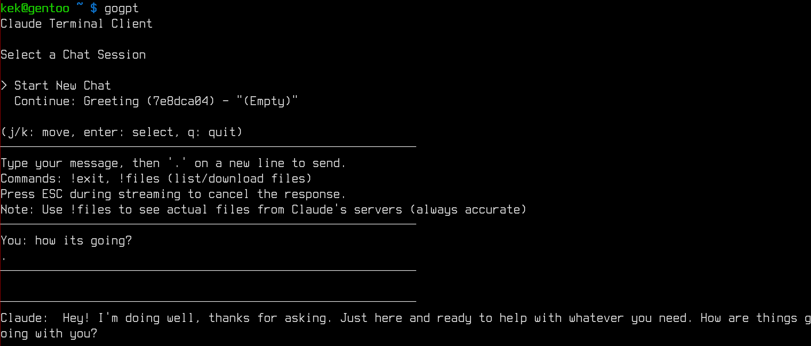

# gogpt

A terminal client for Claude.ai that lets you chat with Claude directly from your command line.



## Features

- **Interactive chat** — Full conversation support with streaming responses
- **MCP support** — Connect external tools via Model Context Protocol
- **Conversation management** — Create new chats or continue existing ones
- **File handling** — View and download files created by Claude
- **Artifact support** — Captures code artifacts and file creations
- **Stream cancellation** — Press ESC to stop Claude mid-response
- **Auto-titling** — Conversations are automatically named based on content
- **Persistent history** — All your conversations sync with claude.ai

## Installation

### From source

```bash
git clone https://github.com/kekkker/gogpt.git
cd gogpt
go build -o gogpt .
```

### Using go install

```bash
go install github.com/kekkker/gogpt@latest
```

## Setup

### Getting Your Session Cookies

1. Open [claude.ai](https://claude.ai) in your browser
2. Log in to your account
3. Open Developer Tools (F12 or Cmd+Option+I)
4. Go to the **Network** tab
5. Refresh the page
6. Click on any request to `claude.ai`
7. Find the `Cookie` header in the request headers
8. Copy the entire cookie string

### First Run

```bash
./gogpt
```

On first run, you'll be prompted to paste your session cookies. They're stored locally in `~/.gogpt/cookies.enc` (base64 encoded).

## Usage

### Starting the Client

```bash
./gogpt
```

You'll see a conversation selector:

```
Select a Chat Session

> Start New Chat
  Continue: Project discussion (a1b2c3d4) - "Can you help me with..."
  Continue: Code review (e5f6g7h8) - "Review this function..."

(j/k: move, enter: select, q: quit)
```

### Chat Interface

Once in a chat:

- Type your message
- Press `.` on a new line to send
- Press `ESC` during streaming to cancel Claude's response

### Commands

| Command | Description |
|---------|-------------|
| `!exit` | Return to conversation selector |
| `!files` | List and download files from the conversation |
| `!mcp` | List available MCP tools |

### Example Session

```
────────────────────────────────────────────────────────────
You: Write a hello world in Go
────────────────────────────────────────────────────────────

────────────────────────────────────────────────────────────
Claude: Here's a simple Hello World program in Go:
────────────────────────────────────────────────────────────

[artifact] main.go
```go
package main

import "fmt"

func main() {
    fmt.Println("Hello, World!")
}
```

### Downloading Files

Use `!files` to see all files Claude has created:

```
=== Files from Claude.ai (3) ===

[1] main.go
    Type: go | Created: Jan 15, 14:32 | Size: 74 bytes
    Path: /mnt/user-data/outputs/main.go

[2] utils.go
    Type: go | Created: Jan 15, 14:33 | Size: 256 bytes
    Path: /mnt/user-data/outputs/utils.go

Enter number to view, 'a' to download all, or press enter to skip:
```

## MCP (Model Context Protocol) Support

gogpt supports MCP servers, allowing Claude to use external tools during conversations.

### Configuration

Create `~/.gogpt/mcp.json`:

```json
{
  "mcpServers": {
    "zig-docs": {
      "command": "npx",
      "args": ["-y", "zig-mcp@latest"]
    },
    "filesystem": {
      "command": "npx",
      "args": ["-y", "@anthropic/mcp-server-filesystem", "/home/user/projects"]
    }
  }
}
```

### How It Works

1. MCP servers start automatically when gogpt launches
2. Available tools are shown: `MCP tools available: 4 (use !mcp to list)`
3. When Claude needs a tool, you'll see: `[MCP: calling search_std_lib] done`
4. Results are automatically fed back to Claude to continue the response

### Example with MCP

```
────────────────────────────────────────────────────────────
You: How do I use ArrayList in Zig?
────────────────────────────────────────────────────────────

────────────────────────────────────────────────────────────
Claude: Let me look that up for you.
────────────────────────────────────────────────────────────
[MCP: calling search_std_lib] done

────────────────────────────────────────────────────────────
Claude: Here's how to use ArrayList in Zig...
────────────────────────────────────────────────────────────
```

### Listing Tools

Use `!mcp` to see all available tools:

```
=== MCP Tools (4) ===

• list_builtin_functions [zig-docs]
  Lists all available Zig builtin functions...

• search_std_lib [zig-docs]
  Search the Zig standard library...
```

## File Storage

```
~/.gogpt/
├── cookies.enc      # Your session cookies (base64)
├── mcp.json         # MCP server configuration
├── artifacts/       # Cached artifacts by conversation
│   └── {conv-id}.json
└── files/           # Auto-saved files
    └── {conv-id}/
        └── downloaded files...
```

## Keyboard Shortcuts

| Key | Context | Action |
|-----|---------|--------|
| `j` / `↓` | Selector | Move down |
| `k` / `↑` | Selector | Move up |
| `<` / `←` | Selector | Previous page |
| `>` / `→` | Selector | Next page |
| `Enter` | Selector | Select conversation |
| `q` | Selector | Quit |
| `ESC` | Chat | Cancel streaming response |
| `.` | Chat | Send message (on new line) |

## Dependencies

- [bubbletea](https://github.com/charmbracelet/bubbletea) — TUI framework
- [keyboard](https://github.com/eiannone/keyboard) — Keyboard input handling
- [uuid](https://github.com/google/uuid) — UUID generation

## Troubleshooting

### "SESSION COOKIES MISSING"

Your cookies have expired or are invalid. Delete `~/.gogpt/cookies.enc` and restart to re-enter them.

### "Failed to get organization ID"

Usually means expired cookies. Get fresh cookies from claude.ai.

### "Warning: Failed to load MCP config"

Check that `~/.gogpt/mcp.json` exists and is valid JSON. The tool will still work without MCP.

### Streaming stops unexpectedly

Check your internet connection. The client uses Server-Sent Events which require a stable connection.

### Files not showing in `!files`

Files appear after Claude's computer use tools finish executing. Give it a moment and try again.

### MCP tools not working

- Ensure the MCP server command is installed (e.g., `npx` requires Node.js)
- Check the server logs for errors
- Verify the config syntax in `mcp.json`

## Disclaimer

This is an unofficial client that uses Claude.ai's web API. It may break if Anthropic changes their API. Use responsibly and in accordance with Anthropic's terms of service.

## License

MIT License — see [LICENSE](LICENSE) for details.
